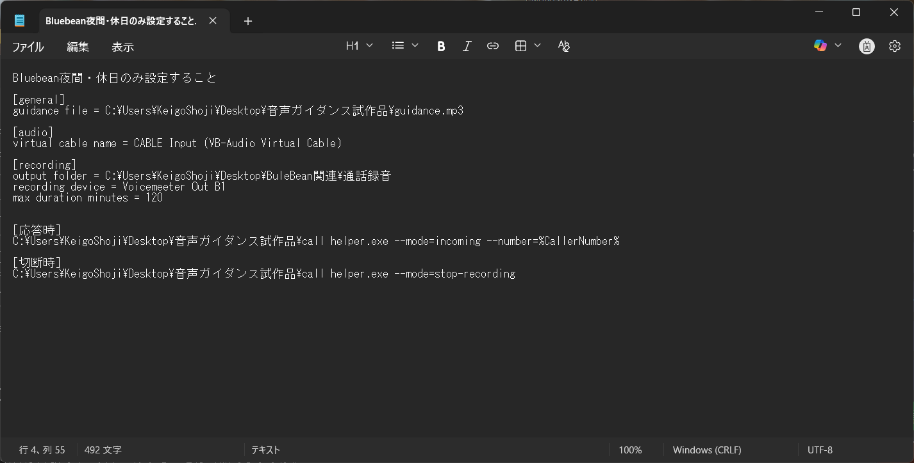
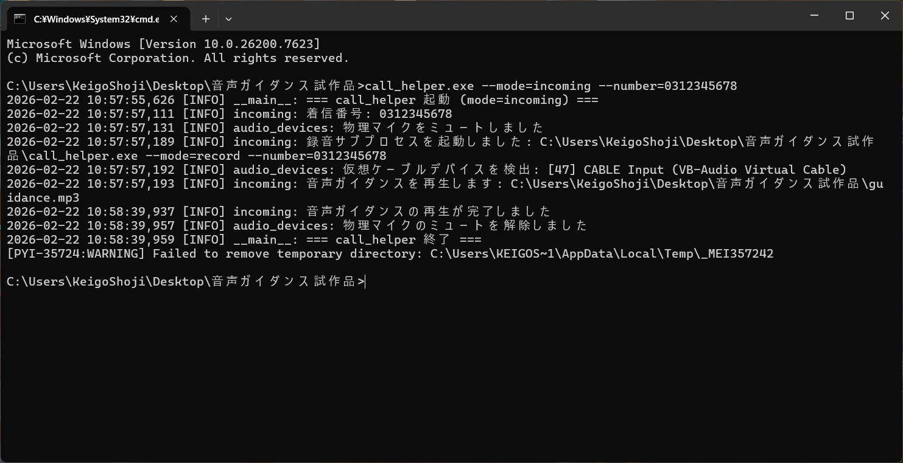
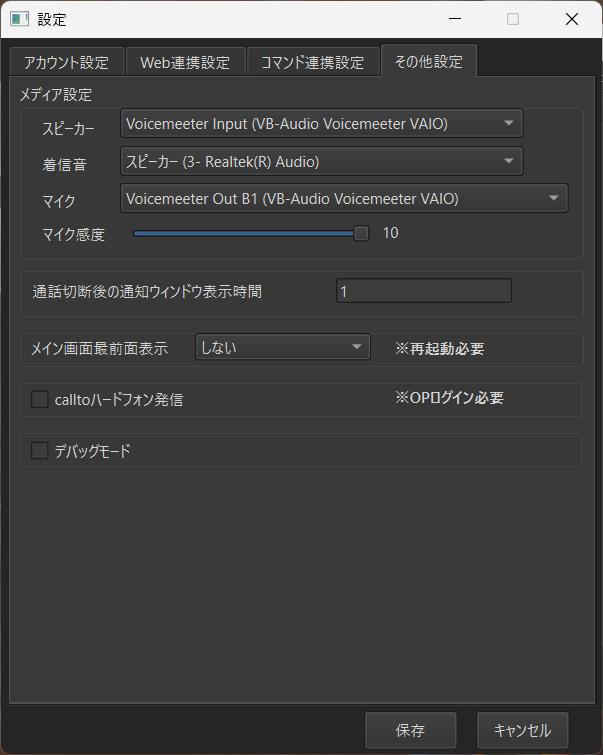
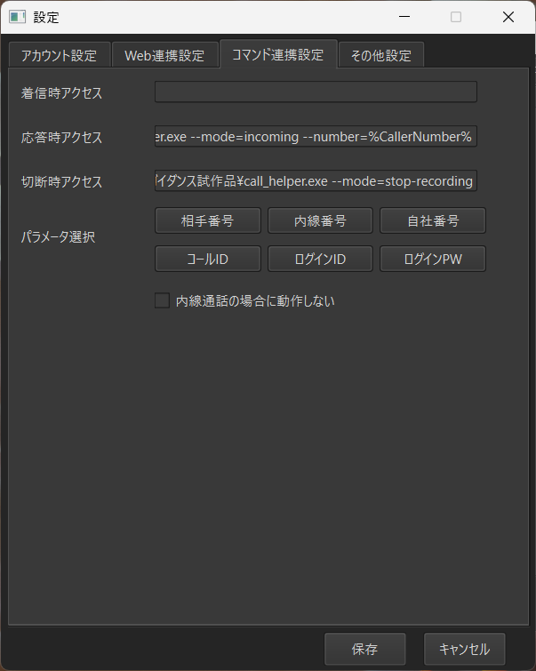
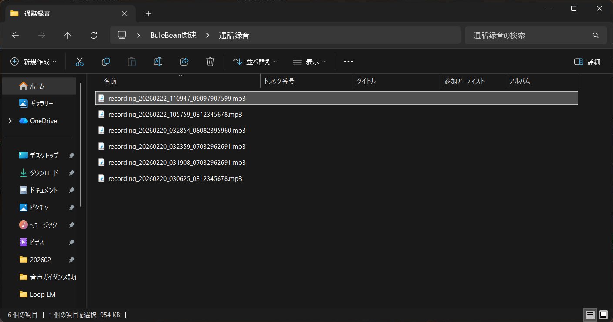

<!-- _class: title -->

# BlueBean Call Helper

BlueBeanコールセンター連携ツール
着信ガイダンス自動再生 & 通話録音

**Keigo Shoji** | MIT License | 2026

---

# 課題と解決策

## コールセンター業務の課題

- 着信時にオペレーターが**手動でガイダンスを再生**する必要がある
- 通話録音の**開始・停止を手動で管理**しなければならない
- 複数のオーディオソフトの操作が煩雑

## BlueBean Call Helper の解決策

- 着信検知時に**自動でガイダンス音声を再生**
- 通話を**自動でMP3録音**（開始・停止を自動制御）
- **単体EXE**で配布可能、追加インストール不要

---

# 主な機能

<div class="columns">
<div>

## 着信ガイダンス自動再生

- 着信時に物理マイクを**自動ミュート**
- MP3ガイダンスをVB-CABLE経由で**通話相手に再生**
- 再生完了後に**自動ミュート解除**
- オペレーターは待っているだけでOK

</div>
<div>

## 通話録音

- オペレーター + 相手の**両方の音声**をキャプチャ
- **メモリバッファリング**で安定録音
- **lameenc**でMP3変換（FFmpeg不要）
- ファイルベースIPCで**安全な停止制御**

</div>
</div>

---

# オーディオルーティング構成

<style scoped>
.route { display: flex; align-items: center; gap: 10px; margin: 6px 0; }
.box { background: #0f3460; border: 2px solid #00d4ff; border-radius: 8px; padding: 6px 14px; font-size: 0.75em; white-space: nowrap; text-align: center; }
.box-vm { background: #1a3a5c; border: 2px solid #ffd93d; border-radius: 8px; padding: 6px 14px; font-size: 0.75em; white-space: nowrap; text-align: center; color: #ffd93d; }
.box-out { background: #2d1b3d; border: 2px solid #ff6b6b; border-radius: 8px; padding: 6px 14px; font-size: 0.75em; white-space: nowrap; text-align: center; color: #ff6b6b; }
.arrow { color: #00d4ff; font-size: 1.3em; font-weight: bold; }
.label { font-size: 0.7em; color: #a0a0a0; }
.section-title { font-size: 0.8em; font-weight: bold; margin: 14px 0 4px 0; }
</style>

<div class="section-title" style="color: #00d4ff;">&#9658; オペレーターの声</div>
<div class="route">
  <div class="box">物理マイク</div>
  <span class="arrow">→</span>
  <div class="box-vm">VoiceMeeter<br>Input 1</div>
  <span class="arrow">→</span>
  <div><div class="box-out" style="margin-bottom:4px;">A: スピーカー</div><div class="box-out">B: BlueBean マイク</div></div>
</div>

<div class="section-title" style="color: #ffd93d;">&#9658; ガイダンス再生</div>
<div class="route">
  <div class="box">guidance.mp3</div>
  <span class="arrow">→</span>
  <div class="box">VB-CABLE</div>
  <span class="arrow">→</span>
  <div class="box-vm">VoiceMeeter<br>Input 2</div>
  <span class="arrow">→</span>
  <div class="box-out">B: BlueBean マイク</div>
</div>

<div class="section-title" style="color: #ff6b6b;">&#9658; 通話録音</div>
<div class="route">
  <div class="box-vm">VoiceMeeter<br>Out B1</div>
  <span class="arrow">→</span>
  <div class="box">recorder.py</div>
  <span class="arrow">→</span>
  <div class="box-out">MP3 保存</div>
  <span class="label">※ 両方の音声をキャプチャ</span>
</div>

---

# STEP 5: VoiceMeeter の設定

<div class="img-right">
<div>

- **Input 1**: 物理マイク → **A + B 有効**
- **Input 2**: CABLE Output → **A + B 有効**
- **VIRTUAL INPUT**: **A のみ有効、B は無効**
  → B有効だとハウリング発生
- 自動起動: Menu → *System Tray (Run at Startup)*

</div>
<div>


</div>
</div>

---

# STEP 6: config.ini の設定

<div class="img-right">
<div>

```ini
[general]
guidance_file = C:\...\guidance.mp3

[audio]
virtual_cable_name = CABLE Input
  (VB-Audio Virtual Cable)

[recording]
output_folder = C:\...\通話録音
recording_device = Voicemeeter Out B1
max_duration_minutes = 120
```

値に **ダブルクォート（"）を付けない** こと

</div>
<div>



</div>
</div>

---

# STEP 7: 動作テスト

<div class="img-right">
<div>

コマンドプロンプトで実行:

```bash
音声ガイダンス試作品.exe --mode=incoming
  --number=0312345678
```

正常時のログ出力:
1. `音声ファイルを事前読み込み完了`
2. `物理マイク・スピーカーをミュート`
3. `音声ガイダンスを再生します`
4. `再生が完了しました`
5. `ミュートを解除しました`

</div>
<div>



</div>
</div>

---

# STEP 8-A: BlueBean マイク設定

<div class="img-right">
<div>

BlueBean「設定」→「その他設定」タブ

| 項目 | 設定値 |
|------|--------|
| スピーカー | Voicemeeter Input |
| マイク | **Voicemeeter Out B1** |

- VoiceMeeter の出力を BlueBean のマイクに設定
- ガイダンス非再生時は物理マイク音声のみが届く
- **常にこの設定のままでOK**

</div>
<div>



</div>
</div>

---

# STEP 8-B + 9: BlueBean コマンド連携設定

<div class="img-right">
<div>

BlueBean「設定」→「コマンド連携設定」タブ

| 設定項目 | コマンド |
|----------|---------|
| **応答時アクセス** | `...\音声ガイダンス試作品.exe --mode=incoming --number=%CallerNumber%` |
| **切断時アクセス** | `...\音声ガイダンス試作品.exe --mode=stop-recording` |

- *応答時*: ガイダンス再生 + 録音自動開始
- *切断時*: 録音停止 → MP3保存
- `%CallerNumber%` は「相手番号」ボタンで挿入

</div>
<div>



</div>
</div>

---

# 録音ファイルの確認

<div class="img-right">
<div>

録音は config.ini の `output_folder` に自動保存

## ファイル命名規則

```
recording_YYYYMMDD_HHMMSS_電話番号.mp3
```

例:
- `recording_20260222_110947_09097907599.mp3`
- `recording_20260220_032359_07032962691.mp3`

通話ごとに**日時 + 電話番号**で自動整理

</div>
<div>



</div>
</div>

---

# 技術的なポイント — なぜ安定して動くのか

<div class="columns">
<div>

## 音声が途切れない
Windows標準の録音方式は音が壊れやすい
→ 高品質方式(WASAPI)を**自動選択**

## 録音中にPCが重くならない
録音データは**メモリ上に一時保存**
→ 録音中のファイル書き込み**ゼロ**

</div>
<div>

## 追加ソフトのインストール不要
MP3変換エンジンを**EXEに内蔵**
→ **EXE1つ配るだけ**で動作する

## 録音の停止が安全
開始・停止を**ファイル信号方式**で制御
→ 録音データが**壊れずに保存**される

</div>
</div>

---

<!-- _class: title -->

# まとめ

BlueBean Call Helper は
**着信ガイダンスの自動再生**と**通話録音**を
ワンクリックで実現するWindows CLIツール

単体EXE配布 | WASAPI対応 | メモリバッファ録音 | FFmpeg不要

---

<!-- _class: title -->

# 最後に — 商用ライセンスのご案内

BlueBean Call Helper を
**商用ソフトウェア**としてご提供します

---

# 市場背景と提供価値

<div class="columns">
<div>

## BlueBean 周辺の現状
- BlueBean特化の導入支援業者が**存在しない**（空白市場）
- 公式サポートは基本設定のみ
  → 高度カスタマイズは**対象外**
- ガイダンス自動再生 + 録音は**BlueBean単体では不可能**

</div>
<div>

## Call Helper の提供価値
- オペレーターの**手作業を完全自動化**
- **単体EXE配布**で即日導入可能
- VoiceMeeter設定を含む**導入支援パッケージ**

</div>
</div>

---

# 料金体系 — 導入パッケージ（初期費用）

| プラン | 価格 | 内容 |
|--------|------|------|
| スタンダード | **100,000円** / 拠点 | EXE配布 + config設定 + リモート導入支援 |
| プロフェッショナル | **200,000円** / 拠点 | 上記 + VoiceMeeter設定代行 + オンサイト対応 |
| エンタープライズ | **300,000円** / 拠点 | 上記 + カスタムガイダンス制作 + 専用保守窓口 |

- 全プラン共通: VB-CABLE + VoiceMeeter の導入手順書付き
- オンサイト対応は関東圏内、それ以外はリモート + 交通費実費

---

# 料金体系 — 月額保守ライセンス

| 規模 | 月額 | 内容 |
|------|------|------|
| 1〜10席 | **10,000円** / 月 | ソフトウェアアップデート + メール問い合わせ |
| 11〜30席 | **20,000円** / 月 | 上記 + 優先サポート + 電話対応 |
| 31席以上 | **30,000円** / 月 | 上記 + 専任担当者 + SLA保証 |

- 最低契約期間: 6ヶ月
- ソフトウェアアップデートはライセンス期間中**無償提供**

---

# 収益シミュレーション — 10社導入時（各社平均10席）

<div class="columns">
<div>

## 初年度（初期費用 + 保守）

| 項目 | 金額 |
|------|------|
| 導入パッケージ × 10社 | 2,000,000円 |
| 月額保守 × 10社 × 12ヶ月 | 2,400,000円 |
| **合計** | **4,400,000円** |

*導入パッケージは初回のみの一括収入*

</div>
<div>

## 2年目以降（保守のみ）

| 項目 | 金額 |
|------|------|
| 月額保守 × 10社 × 12ヶ月 | 2,400,000円 |
| **年間合計** | **2,400,000円** |

*新規顧客が増えるほど積み上がるストック型収益*

</div>
</div>

---

<!-- _class: title -->

# ご覧いただきありがとうございました

BlueBean Call Helper の導入・ライセンスに関する
ご質問やご相談はお気軽にお問い合わせください

**Keigo Shoji**
GitHub: https://github.com/keigoly/call-helper
